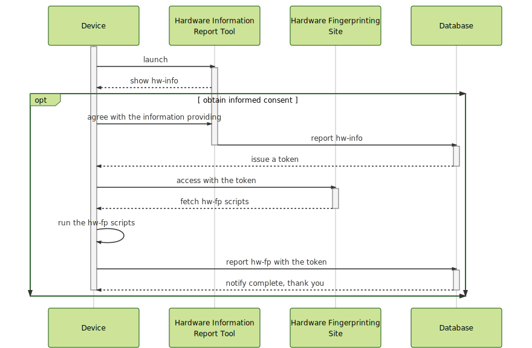

# hw-fp _(hardware-fingerprinting)_

> investigate hardware-based web fingerprinting  
> ハードウェアに依存するFingerprintableな特徴の解析



## Build
### App _(Hardware Information Report Tool, aka rSMBIOS)_
- Change directory
```
$ cd app
```
- Make `config.yml`, followed `config.yml.sample`.
- Download `dmidecode` binary into `bin` directory. See [project page](http://www.nongnu.org/dmidecode/).
- Install dependency packages, and run build. Required Node.js.
```
$ npm i
$ npm run build
```

### Web _(Hardware Fingerprinting Site)_
- Change directory. Install dependency packages. Required Node.js
```
$ cd web/www/public
$ npm i
```
- Change directory. Install dependency packages. Required composer.
```
$ cd web/www
$ composer install
```
- Make `.env`, followed `.env.sample`.
- (Select) If you use Docker, run docker-compose command.
```
$ cd web
$ docker-compose up -d
```
- (Select) If you use build-in Apache and Mysql Database. Enabled `FollowSymLinks` into `apache.conf`.
```
Options FollowSymLinks
```

## Directory Structure
```
.
├── app
│   ├── config.yml.sample
│   ├── src (redux architecture)
│   │   ├── actions
│   │   │   └── index.js
│   │   ├── index.html
│   │   ├── index.js
│   │   ├── main.js
│   │   ├── reducers
│   │   │   └── index.js
│   │   ├── scss
│   │   │   └── style.scss
│   │   └── tags
│   │       ├── app.tag
│   │       └── message-snackbar.tag
│   └── webpack.config.js
├── README.md
└── web
    ├── docker-compose.yml
    ├── mysql
    │   ├── conf.d (mysql configuration)
    │   │   └── my.cnf
    │   ├── initdb.d (initialize mysql database)
    │   └── log (output mysql log)
    ├── php
    │   ├── conf (php configuration)
    │   │   ├── conf.d
    │   │   │   ├── docker-php-ext-gmp.ini
    │   │   │   ├── docker-php-ext-pdo_mysql.ini
    │   │   │   └── security.ini
    │   │   └── php.ini
    │   ├── Dockerfile
    │   └── log (output php log)
    ├── resources (some resources source)
    │   ├── images
    │   │   └── hero.md
    │   └── wasm (explorer experimental features)
    │       ├── emcc.bat
    │       └── emcc.sh
    └── www
        ├── app (MVC architecture)
        │   ├── Controllers
        │   │   ├── Controller.php (Base controller)
        │   │   ├── HwFpController.php (extends base controller)
        │   │   └── HwInfoController.php (extends base controller)
        │   ├── Models
        │   │   ├── DB.php (Database connection with Mysql)
        │   │   ├── HwFp.php
        │   │   ├── HwInfo.php
        │   │   └── Model.php (Database basic model)
        │   └── Views
        │       ├── 404.phtml
        │       ├── index.phtml
        │       ├── layouts (base layout components)
        │       │   ├── base.phtml
        │       │   ├── footer.phtml
        │       │   └── header.phtml
        │       └── thanks.phtml
        ├── composer.json
        ├── composer.lock
        └── public (open public directory)
            ├── images
            ├── index.php (entry point)
            ├── package.json
            ├── package-lock.json
            ├── scripts
            │   ├── main.js
            │   ├── typedarray.js
            │   └── worker.js
            └── styles
                └── main.css
```

## Web Entity Models
### Entities
- `HwFp`
- `HwInfo`
### Relations
- `HwFp` --- `HwInfo`

## Web Entry point
- [x] [GET /](#get)
- [x] [POST /hwInfo](#post-hwinfo)
- [x] [GET /hwFp/:token](#get-hwfptoken)
- [x] [POST /hwFp](#post-hwfp)
### GET /
Respond project home page.
#### Response
- Status: 200 OK
- Content-Type: text/html; charset=UTF-8
### POST /hwInfo
Recieve rSMBIOS report.
#### Request
- Content-Type: application/json
```json
{
  "name": "[Required: reporter name from rSMBIOS]",
  "smbios": "[Required: SMBIOS generated from rSMBIOS]",
  "version": "[Required: rSMBIOS version]"
}
```
#### Response
- Status: 200 OK
- Content-Type: application/json
```json
{
  "result": "success",
  "token": "[a unique token bound HwInfo.id]"
}
```
### GET /hwFp/:token
Respond hardware fingerprinting page.
#### Request
`token` is the same as `token` in [POST /hwInfo](#post-hwinfo) response.
#### Response
- Status: 200 OK
- Content-Type: text/html; charset=UTF-8
### POST /hwFp
##### Request
- Content-Type: application/json
```json
{
  "math": "[Required]",
  "worker": "[Required]",
  "aes": "[Required]",
  "endian": "[Required]",
  "memory": "[Required]",
  "gpu": "[Required]",
  "gpgpu": "[Required]",
  "version": "[Required: Hardware Fingerprinting Site version]",
  "token": "[Required: It's the same as POST /hwInfo response]"
}
```
##### Response
- Status: 200 OK
- Content-Type: application/json
```json
{
  "result": "success",
  "hwFp": "[<HwFp> entiry by stored post data]"
}
```
